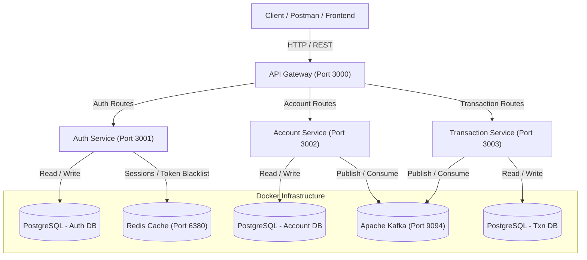
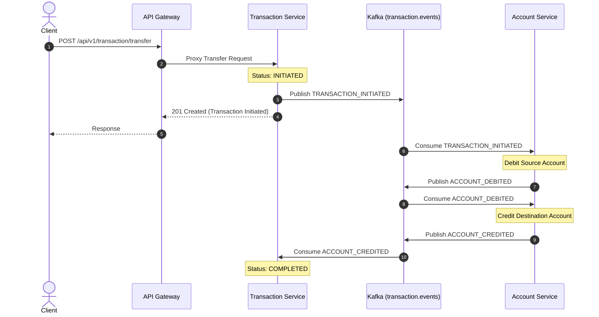
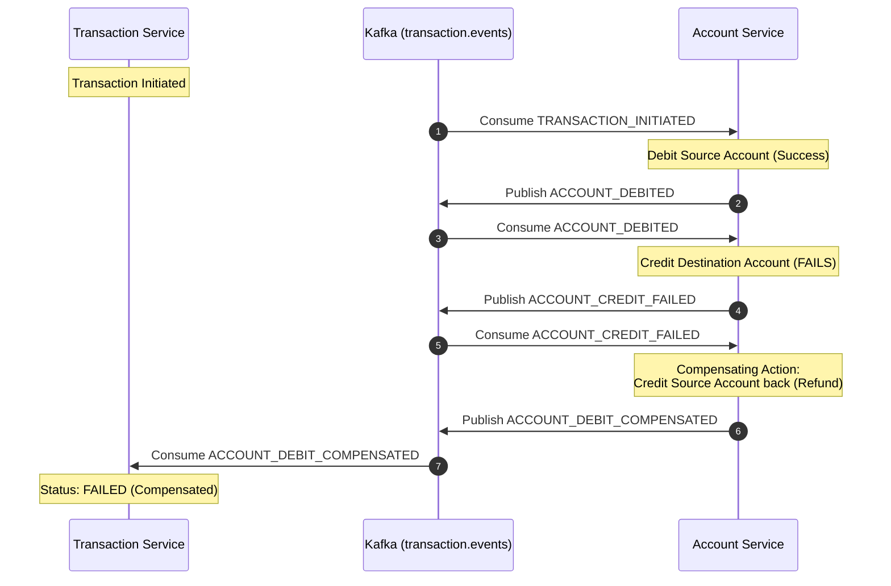

# 🏦 Bank Microservices - Event-Driven Financial Platform

A distributed, event-driven banking microservices application built with **Node.js**, **TypeScript**, **Express**, **Apache Kafka**, **PostgreSQL**, **Redis**, and **Docker**.

The platform demonstrates production-grade microservice principles, including **API Gateway Routing**, **JWT Authentication**, **Distributed Event-Driven Architecture**, and the **Saga Pattern with Compensating Transactions** for eventual consistency across services.

---

## 📐 System Architecture



---

## 🧩 Microservices Overview

| Service Name | Port | Description | Primary Responsibilities |
|---|---|---|---|
| **API Gateway** | `3000` | Entry point for external traffic | Route proxying, Rate limiting, CORS, Helmet security |
| **Auth Service** | `3001` | User identity & authentication | Registration, Login, Password hashing (bcrypt), JWT tokens |
| **Account Service** | `3002` | Account management | Account creation, Balance updates, Account listing/deletion |
| **Transaction Service** | `3003` | Fund transfers & transactions | Initiates transactions, Manages Saga state transitions |

### 🛠️ Shared Workspace Packages (`packages/`)
- **`@bank_microservices/constants`**: Shared event topic names, transaction status enums, and error codes.
- **`@bank_microservices/logger`**: Standardized Winston/Pino logger across all services.
- **`@bank_microservices/redis-client`**: Redis connection pool wrapper.
- **`@bank_microservices/kafka-client`**: Kafka Producer/Consumer client setup using KafkaJS.

---

## 🔄 Distributed Transactions: Saga Pattern

In microservice architectures, each service owns its database. A money transfer across accounts cannot use traditional single-database ACID transactions. Instead, this platform implements the **Choreography-based Saga Pattern** over Apache Kafka to guarantee **Eventual Consistency**.

### 1. Successful Transfer Flow



### 2. Failure & Compensating Transaction Flow

If the destination account credit fails (e.g. invalid destination account, account closed, or system error), the system initiates a **Compensating Transaction** to refund the source account and restore consistent state.



---

## 🚀 Easy Installation & Setup Guide

### Prerequisites
Make sure you have the following installed on your machine:
- [Node.js](https://nodejs.org/) (v18 or higher)
- [Docker Desktop / Engine](https://www.docker.com/) (Running)
- [Git](https://git-scm.com/)

---

### Step 1: Clone Repository
```bash
git clone https://github.com/Arghya003/Bank-Miroservice.git
cd bank_microservice
```

---

### Step 2: Start Infrastructure (PostgreSQL, Redis, Kafka)
Start all database and message broker containers via Docker Compose:

```bash
docker compose up -d
```

Verify containers are running:
```bash
docker ps
```
*Expected containers: `postgres` (port 5433), `redis` (port 6380), `kafka` (port 9094), `kafka-ui` (port 8080).*

---

### Step 3: Initialize Kafka Topics
Run the topic initialization script to create required Kafka event topics:

**Linux / macOS / Git Bash:**
```bash
bash init.sh
```

**Windows PowerShell:**
```powershell
docker exec kafka kafka-topics.sh --bootstrap-server localhost:9094 --create --if-not-exists --topic user.registered --partitions 10 --replication-factor 1
docker exec kafka kafka-topics.sh --bootstrap-server localhost:9094 --create --if-not-exists --topic account.created --partitions 10 --replication-factor 1
docker exec kafka kafka-topics.sh --bootstrap-server localhost:9094 --create --if-not-exists --topic account.deleted --partitions 10 --replication-factor 1
docker exec kafka kafka-topics.sh --bootstrap-server localhost:9094 --create --if-not-exists --topic transaction.events --partitions 10 --replication-factor 1
```

---

### Step 4: Build Shared Packages
Build all internal private packages in [`packages/`](file:///c:/switch_proj/bank_microservice/packages):

**Windows PowerShell:**
```powershell
cd packages\constants; npm install; npm run build; cd ..\..
cd packages\logger; npm install; npm run build; cd ..\..
cd packages\redis-client; npm install; npm run build; cd ..\..
cd packages\kafka-client; npm install; npm run build; cd ..\..
```

**Linux / macOS:**
```bash
(cd packages/constants && npm install && npm run build)
(cd packages/logger && npm install && npm run build)
(cd packages/redis-client && npm install && npm run build)
(cd packages/kafka-client && npm install && npm run build)
```

---

### Step 5: Install & Start Microservices

Install dependencies for all services:

**Windows PowerShell:**
```powershell
cd services\auth-service; npm install; cd ..\..
cd services\account-service; npm install; cd ..\..
cd services\transaction-service; npm install; cd ..\..
cd services\api-gateway; npm install; cd ..\..
```

Now start each microservice. For local development, open **4 terminal windows** and run:

| Terminal | Service | Command | URL / Port |
|---|---|---|---|
| **Terminal 1** | Auth Service | `cd services/auth-service && npm run dev` | `http://localhost:3001` |
| **Terminal 2** | Account Service | `cd services/account-service && npm run dev` | `http://localhost:3002` |
| **Terminal 3** | Transaction Service | `cd services/transaction-service && npm run dev` | `http://localhost:3003` |
| **Terminal 4** | API Gateway | `cd services/api-gateway && npm run dev` | `http://localhost:3000` |

---

### Step 6: Run End-to-End Test Suite
To verify that all services, databases, Kafka events, and Saga flows are functioning properly:

```bash
cd e2e-tests
npm install
npm test
```

---

## 📡 API Reference Overview

All requests should be routed through the **API Gateway** at `http://localhost:3000`.

### 🔑 Auth Endpoints (`/api/v1/auth`)
| Method | Endpoint | Description | Auth Required |
|---|---|---|---|
| `POST` | `/api/v1/auth/register` | Register a new user account | ❌ No |
| `POST` | `/api/v1/auth/login` | Authenticate user & get JWT token | ❌ No |
| `POST` | `/api/v1/auth/logout` | Invalidate token / session | 🔑 Yes |

### 💳 Account Endpoints (`/api/v1/accounts`)
| Method | Endpoint | Description | Auth Required |
|---|---|---|---|
| `POST` | `/api/v1/accounts` | Create a new bank account | 🔑 Yes |
| `GET` | `/api/v1/accounts` | List user's bank accounts | 🔑 Yes |
| `DELETE` | `/api/v1/accounts/:accountNumber` | Delete account | 🔑 Yes |
| `POST` | `/api/v1/accounts/internal-transaction` | Deposit / Withdraw balance | 🔑 Yes |

### 💸 Transaction Endpoints (`/api/v1/transaction`)
| Method | Endpoint | Description | Auth Required |
|---|---|---|---|
| `POST` | `/api/v1/transaction/transfer` | Initiate money transfer via Saga | 🔑 Yes |
| `GET` | `/api/v1/transaction/:transactionId` | Get transaction status & details | 🔑 Yes |

---

## 📁 Repository Structure

```text
bank_microservice/
├── docker-compose.yml        # PostgreSQL, Redis, Kafka, Kafka-UI services
├── init.sh                   # Kafka topic initialization script
├── packages/                 # Shared Monorepo Packages
│   ├── constants/            # Event types, topic names, error codes
│   ├── kafka-client/         # KafkaJS wrapper (Producer & Consumer)
│   ├── logger/               # Standardized logger
│   └── redis-client/         # ioredis client setup
├── services/                 # Independent Microservices
│   ├── api-gateway/          # Express API Gateway (Port 3000)
│   ├── auth-service/         # User Authentication Service (Port 3001)
│   ├── account-service/      # Bank Account Management Service (Port 3002)
│   └── transaction-service/  # Saga Transaction Service (Port 3003)
└── e2e-tests/                # End-to-End Jest Integration Tests
```

---

## 🛡️ License

This project is licensed under the MIT License - see the [LICENSE](LICENSE) file for details.
